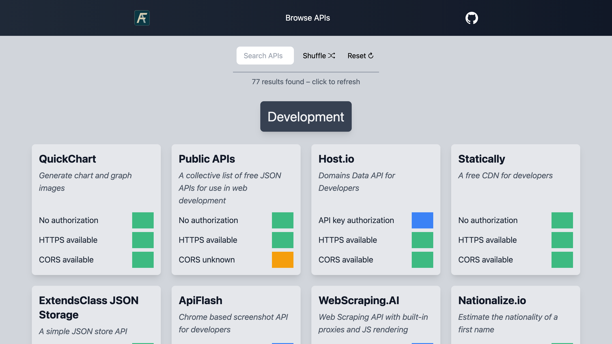

# Free APIs

_A collection of free APIs for new and experienced developers, derived from [Public APIs](https://github.com/public-apis/public-apis)._

This project was built in React.js using [Create React App](https://github.com/facebook/create-react-app) and [Tailwind CSS](https://tailwindcss.com) for styling.

## Quick Overview

Free APIs houses a list of APIs in a blazing fast website. There are two main modes - to view them all at once or by category. The former is more useful in looking for new project ideas and getting the right API as a content source, as well as for searching the full collection and checking the authorization method, CORS, and HTTPS. The category mode lets you narrow it down further and gain more control in your searches and browsing. Clicking on any of the cards takes you to the respective API website or documentation.

_That's the ultimate goal._ A quick resource for finding APIs and their links. To discover new ideas, get inspiration, or find that missing puzzle piece to your project. I've made the site with this in mind, employing a modern, accessible, and intuitive design.

If you have any suggestions, optimizations, or improvements, go ahead and [**open a GitHub issue**](https://github.com/Free-APIs/Free-APIs.github.io/issues). And if you'd like to get in touch, **[feel free to reach out!](mailto:freeapis256@gmail.com?subject=Hey there!)**

Check out the website [_here_](https://free-apis.github.io).
